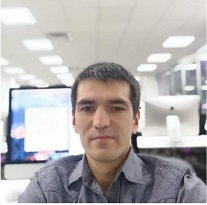

# [Halim Hamidov](https://www.instagram.com/halimjoni/)

  

### Contact Info 

+ E-MAIL: halim.hamidov@yandex.ru 
+ FB: halim.hamidov.9
+ GH: HalimHamidov
+ SKYPE: halimjonskype1
+ Codewars: HalimHamidov

### Summary

* **My goal:** To  build a billion dollar unicorn IT digital company.
* **My wishes:** To learn fast, effective in comfortable way several innovative technologies and implement them in real world in order to create value in many ways.
* **Important:** Everyday I must help humankind to change their world better than never in their lives.
* **Desire:** I want to discover and realize my mission in full potential.
* **Want:** I want to transform the moment of recognition to moment of action as described well in 'The Matrix' because we live once and we must discover our freedom of being the 'One' and 'Unique'.
* **My main strengths** are analysis and synthesis of complex problems drawn on mind-maps.
+ I like to be well prepared and plan everything before starting working on a project.
+ I like to  work with my family members and as a supportive and friendly team mate I would like to inherit it to team projects as well.

## Skills 

* **programming languages:** C, HTML, CSS, JavaScript
* **frameworks, methodologies, version control, tools:** GIT, Unix, Shell, Docker  

## Code examples

[42 coding school 'C' library project:](https://github.com/HalimHamidov/21-projects/tree/master/libft/Solutions%20to%20libft/libft_with_comments_and_main.c)

## Experience:

+ [C project "Get_next_line":](https://github.com/HalimHamidov/21-projects/tree/master/GNL_test/apearl)

+ [Docker project "How to docker and dockerfiles":](https://github.com/HalimHamidov/Docker/tree/master/apearl)

+ [Beeinterns Webdriver autotest scripts written on node.js](https://github.com/88Group/BeeInterns)

+ [Web 2.0 HTML project "You are a Big Success"](http://sorbontaxi.online/0-html/)

+ Have a teaching experience in 1C Enterprise configurations: Trade System, Management of Manufacturing Companies, Complex Automation System, and IFRS system. 

+ I am CAP (certified accounting practitioner under IFRS). 

### Education:
+ Currently the student of [21-IT-school in Russian Federation](http://21-school.ru/)
+ *COURSES.EDX.ORG-W3Cx:* HTML5.0x HTML5 and CSS Fundamentals  
+ *CODECADEMY.COM* Introduction to HTML, Learn CSS, Introduction To JavaScript  
+ *WHARTON UNIVERSITY OF PENNSYLVANIA’S ONLINE OFFERING* An introduction to financial accounting. 
+ *BERKELEYX, ONLINE OF THE UNIVERSITY OF CALIFORNIA* College Writing 21x: Principles of Written English. 
+ *UNIVERSITY OF MARYLAND, COLLEGE PARK'S ONLINE* Developing Innovative Ideas for New Companies. 
+ *AN ONLINE LEARNING INITIATIVE OF MITX THROUGH EDX-3.086x*: Innovation and Commercialization. Etc. 
+ Held 1st place at the republican ***Olympiad of Physics science*** at 10th grade. 

## Languages:
- [x] English - Proficient
- [x] Turkish - Intermediate
- [x] Russian - Highly proficient 
- [x] Tajik - Native
